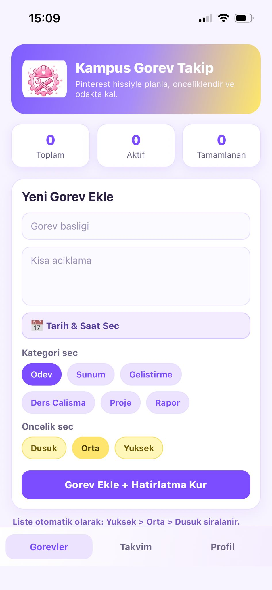

<div align="center">

# 📱 Kampüs Görev Takip Sistemi

**Üniversite öğrencileri için akıllı, bildirimli ve görsel görev yönetimi uygulaması**

Kampüs Görev Takip Sistemi, yoğun akademik takvim içinde boğulan öğrenciler için "daha az karmaşa, daha fazla odak" prensibiyle geliştirildi. Sadece bir yapılacaklar listesi değil, aynı zamanda motivasyonu artıran görsel bir asistan.


</div>

---

## 📸 Ekran Görüntüleri

| Ana Ekran (Boş) | Görev Listesi | Görev Eklendi Efekti |
|:---:|:---:|:---:|
|  |  |  |
| Logo + form + istatistikler | Eklenen görev kartı | ✨ Animasyon overlay'i |

| Takvim Sekmesi | Profil Sekmesi |
|:---:|:---:|
|  |  |
| Tarihi olan aktif görevler | Tamamlanma oranı & özet |

---

## 🚀 Özellikler

- 📝 **Görev Ekleme** — Başlık, açıklama, kategori ve öncelik ile görev oluştur
- 📅 **Tarih & Saat Seçimi** — Önce gün, ardından saat seç; seçim biter bitmez takvim kapanır
- 🔔 **Çift Bildirim** — Son tarihten **1 gün önce** ve **1 saat önce** ayrı ayrı telefon bildirimi
- 🔊 **Ekleme Sesi** — Her görev eklenişinde özel bir ses çalar
- ✨ **Parıltı Animasyonu** — Görev eklenince ekranda altın-pembe animasyonlu "Görev Eklendi!" efekti
- 🏷️ **Öncelik & Kategori** — Düşük / Orta / Yüksek öncelik; 6 farklı akademik kategori
- 📊 **İstatistik Kartları** — Toplam / Aktif / Tamamlanan görev sayıları anlık güncellenir
- 🔍 **Filtreleme** — Tüm, Aktif veya Tamamlanan görevleri filtrele
- 🎨 **Modern UI** — LinearGradient, soft renk paleti, kart tabanlı Pinterest tarzı tasarım

---

## 🎯 Bu Uygulama Kimler İçin?

Bu uygulama, özellikle akademik hayatını düzene sokmak isteyen **üniversite öğrencileri** için tasarlandı. Vizeler, ödev teslimleri ve sunum tarihleri arasında kaybolmamak için sade ama etkili bir çözüm arayan herkes için idealdir.

## 💡 Diğer Uygulamalardan Farkı Ne?

Sıradan "To-Do" uygulamaları sadece liste sunarken, Kampüs Görev Takip Sistemi:
1. **Motivasyon Odaklıdır:** Her görev eklendiğinde çalan ses ve "Parıltı Animasyonu" ile kullanıcıya küçük bir başarı hissi verir.
2. **Akademik Dil Kullanır:** Kategoriler ve öncelikler tamamen öğrenci ihtiyaçlarına (Vize, Proje, Rapor vb.) göre optimize edilmiştir.
3. **Kritik Hatırlatma:** Birçok uygulama tek bir bildirim atıp unuturken, bu sistem sizi kritik zamanlarda iki kez uyarır.

---

## 🔔 Akıllı Bildirim Sistemi Detayları

Uygulamanın en güçlü yanı, **"Unutmaya Yer Yok"** mantığıyla çalışan bildirim sistemidir. Bir görev oluşturup tarih belirlediğinizde sistem otomatik olarak:

*   ⏰ **24 Saat Kala:** "Yarın teslim günü!" uyarısı göndererek son güne sıkışmanızı engeller.
*   🔔 **1 Saat Kala:** "Son 60 dakika!" uyarısı ile son kontrolleri yapmanız için sizi uyarır.

Bu çift katmanlı koruma sayesinde, en yoğun zamanlarınızda bile teslim tarihlerini kaçırmazsınız.

---

## 📖 Kullanım Rehberi

1. **Görev Oluştur:** Ana ekrandaki formu kullanarak görevinize bir başlık verin.
2. **Kategori ve Öncelik Seç:** Görevin türünü (Ödev, Sunum vb.) ve aciliyetini belirleyin.
3. **Zamanı Belirle:** Takvimden günü ve saati seçin. Seçim biter bitmez sistem bildirimleri planlar.
4. **Takip Et:** Takvim sekmesinden yaklaşan görevleri görün, Profil sekmesinden başarınızı (tamamlanma oranını) izleyin.


---

## 🛠️ Teknoloji Yığını

| Paket | Versiyon | Amaç |
|---|---|---|
| `react-native` | 0.81.5 | Mobil uygulama çerçevesi |
| `expo` | ~54.0.33 | Geliştirme & dağıtım altyapısı |
| `typescript` | ~5.9 | Tip güvenli geliştirme |
| `expo-notifications` | ~0.32 | Yerel push bildirimleri |
| `expo-av` | — | Ses çalma |
| `expo-linear-gradient` | ~15.0 | Gradient UI bileşenleri |
| `@react-native-community/datetimepicker` | 8.4.4 | Tarih & saat seçici |

---

## 📁 Proje Yapısı

```
kampus.app/
├── App.tsx              # Tüm ekranlar ve mantık
├── logo.png             # Uygulama logosu (ikon + hero card)
├── app.json             # Expo yapılandırması
├── assets/
│   └── add_sound.wav    # Görev ekleme sesi
├── package.json
└── tsconfig.json
```

---

## 🗂️ Veri Modeli

```typescript
type Task = {
  id: string;
  title: string;
  description: string;
  dueDateLabel: string;       // "14.05.2026 09:30"
  dueDateISO: string | null;  // ISO 8601 formatı
  category: 'Odev' | 'Sunum' | 'Gelistirme' | 'Ders Calisma' | 'Proje' | 'Rapor';
  priority: 'Dusuk' | 'Orta' | 'Yuksek';
  completed: boolean;
  createdAt: number;          // timestamp
};
```

---

## 🔔 Bildirim Akışı

```
Görev Eklenir
     │
     ├─► dueDateISO var mı?
     │       │
     │      Evet
     │       │
     │       ├─► 1 gün önce > şimdi? ──► 📅 "1 Gün Kaldı!" bildirimi planla
     │       │
     │       └─► 1 saat önce > şimdi? ─► ⏰ "1 Saat Kaldı!" bildirimi planla
     │
     └─► Ses çal + Parıltı animasyonu göster
```

---

## ⚙️ Kurulum

```bash
# 1. Bağımlılıkları yükle
npm install

# 2. Geliştirme sunucusunu başlat
npm start

# 3. Expo Go uygulamasıyla QR kodu okut
#    → Android: Expo Go içinden kamerayı aç
#    → iOS: Kamera uygulamasıyla QR'ı tara
```

**Gereksinimler:** Node.js 18+ · Expo Go uygulaması (Android/iOS)

---

## 📋 Sekme Yapısı

| Sekme | İçerik |
|---|---|
| 🗂 **Görevler** | Görev ekleme formu + görev listesi (önceliğe göre sıralı) |
| 📅 **Takvim** | Tarihi olan aktif görevlerin listesi |
| 👤 **Profil** | Tamamlanma oranı ve yüksek öncelikli aktif görev sayısı |

---

## 🚀 Proje Durumu ve Geliştirme Notu

Bu proje aslında bir ödev olarak yola çıktı, ancak bir öğrenciden bir öğrenciye geçecek şekilde; kendim de günlük hayatta kullanmak istediğim özellikleri ekleyerek bir **"Demo/MVP"** sürümü haline getirdim. 

Başlangıç olarak gayet stabil ve görsel olarak tatmin edici bir yapıda olsa da, gelecekte şu özelliklerle geliştirilmeye açıktır:
- ☁️ Bulut tabanlı veri senkronizasyonu (Firebase/Supabase)
- 🌓 Dark Mode desteği
- 📎 Görevlere dosya veya fotoğraf ekleme özelliği

Bence bir başlangıç projesi için hem şık hem de oldukça fonksiyonel bir araç!
